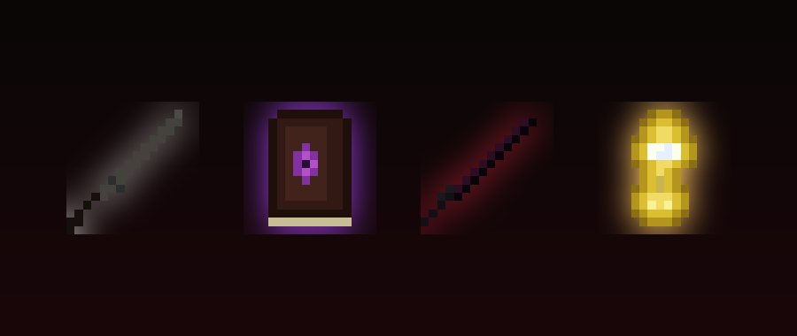

# Horror: The Voice

> A horror add-on: a Voice in your head starts as your friend and turns evil over the in-game days.

An unseen narrator whispers in the chat at night. What he says depends on the chapter of the story, which unfolds over in-game **days**, not minutes. Water is completely safe; spectators are ignored.

## What it does

- **Story in chapters**: The Whispering (day 0-2), The Hunger (day 3-6, first Blood Night), The Finale (day 7+), Epilogue after the boss
- **Blood Nights** with red fog, custom music, darkness and lightning around players
- **Watcher-kin creatures** (watcher, crawler, hollow, effigy and more) with scrambled heads, custom loot and spawn rules
- Procedurally generated music and sounds (dread drone, blood-night loop, whispers, heartbeat)
- Progress is stored in world dynamic properties and survives restarts

## Download

Download **`Horror-The-Voice-v0.4.1.mcaddon`** from the [releases page](../../releases) (or straight from this repository) and open it - Minecraft imports the packs.

1. Create or edit a world and open **Add-Ons**.
2. Activate the **Behavior Pack** and the **Resource Pack** of this add-on.
3. Requires Minecraft Bedrock **1.21.110 or newer**.

If items are missing in your world, check the world's *Experiments* page and enable *Beta APIs* and *Holiday Creator Features* as a fallback.

New to this? Follow **[SETUP-HELP.md](SETUP-HELP.md)** - it walks you through installing and starting it.

## Controls for operators

`/scriptevent horror:menu` `horror:pause` `horror:start` `horror:reset` - open the menu, pause, start or reset the story. Create the world with cheats enabled.

## Dev Book

Every pack of mine carries a small easter egg: craft the **Dev Book** with **9 logs** (any wood type, 3x3 in a crafting table) and right-click it. It opens like a book: page 1 the credits, page 2 what this mod is, page 3 the GitHub links (Minecraft cannot open links, so they are shown as text). It also sits in the creative inventory under *Equipment*.

## Notes

- All in-game text is English.
- Not an official Minecraft product. Not approved by or associated with Mojang or Microsoft.

---

Made by **dev:#2444** - [github.com/hash2444](https://github.com/hash2444) - [horror-addon](https://github.com/hash2444/horror-addon)
